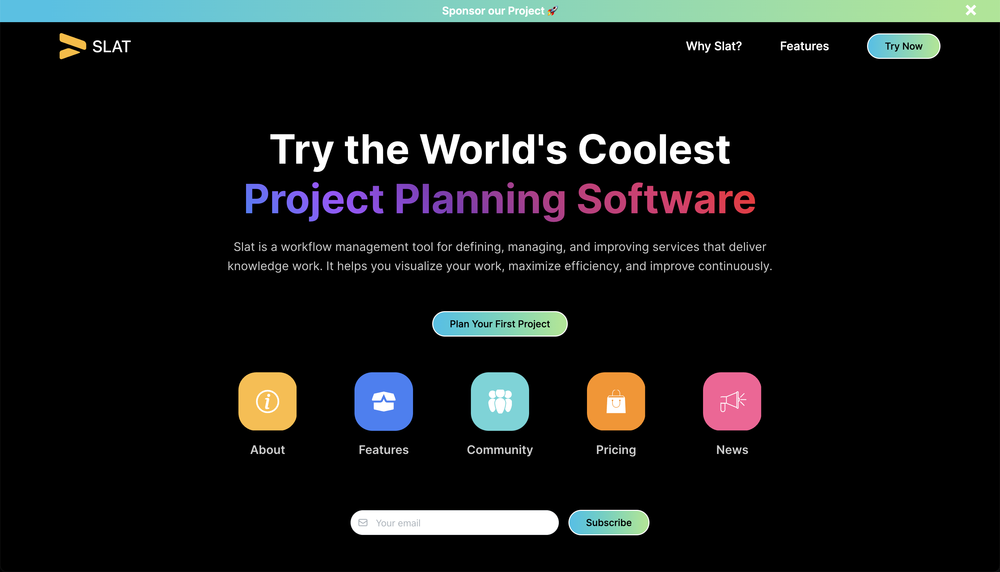
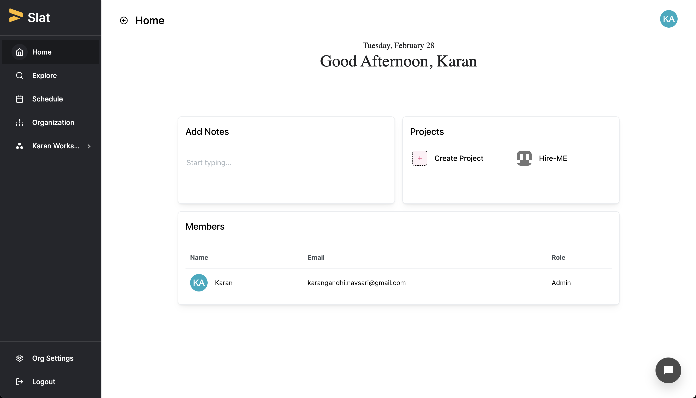
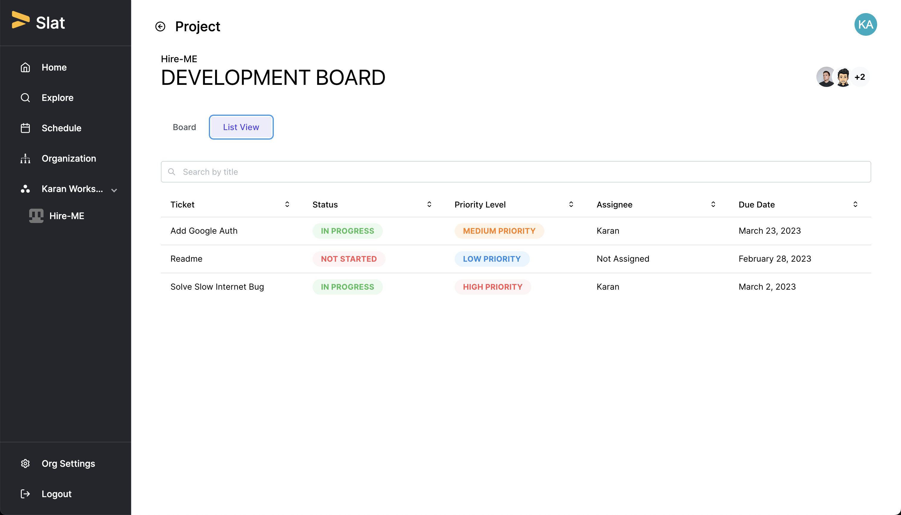

# SLAT - A Workflow Management System.💫✨

### Slat is a workflow management tool for defining, managing, and improving services that deliver knowledge work. It aims to help you visualise your work, maximize efficiency, and improve continuously.

# Features

- **_Create and manage Kanban boards online_**
- **_Hit your deadlines with shared team calendar software_**
- **_Save Time By Adopting Automation_**

### :rocket:Glimpse :dizzy::dizzy:  

  

### Detail Documentation with loom video is on the way! :blush:

### If you encounter any difficulty running it, feel free to contact on my email :smile:

### If you liked our work do give us a star :star::star::star: It Encourages us to do more :wink: :dizzy:
